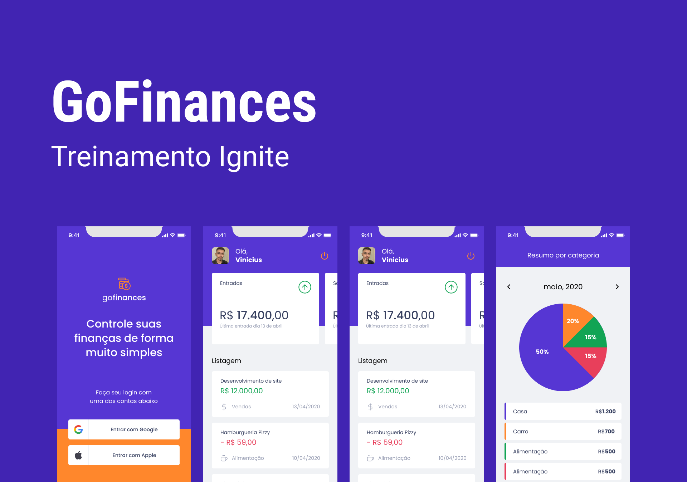

<h1 align="center">
    
</h1>

<h4 align="center">
  💸 Manage your finances easily!
</h4>

## :tv: Demo


## :rocket: Technologies

This project was developed in Rocketseat's Ignite Bootcamp, using the following technologies:

-  [React Native](https://reactnative.dev/)
-  [TypeScript](https://www.typescriptlang.org/)
-  [Styled Components](https://styled-components.com/)
-  [Expo](https://expo.io/)
-  [React Navigation](https://reactnavigation.org/)
-  [React Native Vector Icons](https://github.com/oblador/react-native-vector-icons)
-  [VS Code][vc]

## :information_source: How To Use

To clone and run this application, you'll need [Git](https://git-scm.com), [Node.js v10.16][nodejs] or higher + [Yarn v1.13][yarn] or higher installed on your computer. From your command line:

```bash
# Clone this repository
$ git clone git@github.com:vini-coelho/ignite-react-native-gofinances.git

# Go into the repository
$ cd ignite-react-native-gofinance

# Install dependencies
$ yarn install

# Start the bundler
$ expo start
```

## :memo: License

This project is under the MIT license. See the [LICENSE](./LICENSE) for more information.

---

Made with ♥ by Vinicius Coelho :wave: [Get in touch!](https://www.linkedin.com/in/viniciustcoelho/)

[nodejs]: https://nodejs.org/
[yarn]: https://yarnpkg.com/
[vc]: https://code.visualstudio.com/
[vceditconfig]: https://marketplace.visualstudio.com/items?itemName=EditorConfig.EditorConfig
[vceslint]: https://marketplace.visualstudio.com/items?itemName=dbaeumer.vscode-eslint
